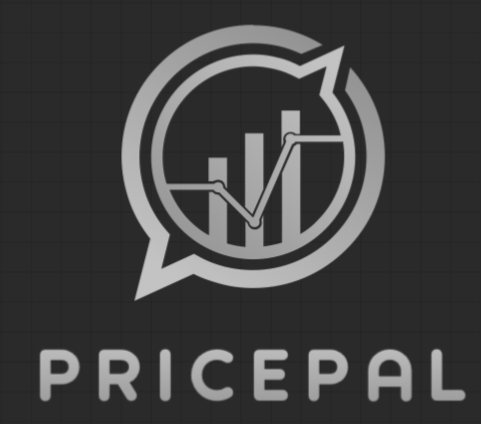

<div align="center">



# PricePal — Stock Price Predictor

**An LSTM-powered web application that predicts stock prices using deep learning**

[](https://pricepal.streamlit.app)


[Live Demo](https://pricepal.streamlit.app) &nbsp;&bull;&nbsp; [Report Bug](https://github.com/ShashiBanagere/Stock_price_prediction/issues) &nbsp;&bull;&nbsp; [Request Feature](https://github.com/ShashiBanagere/Stock_price_prediction/issues)

---

</div>

## About The Project

PricePal uses a pre-trained **LSTM (Long Short-Term Memory)** neural network to analyze historical stock data and predict future prices. It takes a 5-day look-back window of OHLC (Open, High, Low, Close) averages to forecast the next day's stock price.

The app is built with **Streamlit** for an interactive, real-time experience — no coding required from the end user.

### Key Features

- **Live Ticker Lookup** — Fetch real-time stock data for any symbol via Yahoo Finance
- **CSV Upload** — Analyze your own historical stock data files
- **Visual Indicators** — Interactive charts for OHLC average, HLC average, and closing price
- **Train vs Test Visualization** — See how well the model fits historical data
- **Next-Day Prediction** — Get a predicted price for the next trading day

---

## How It Works

```
Historical Stock Data ──► OHLC Averaging ──► MinMax Scaling ──► LSTM Model ──► Predicted Price
                              │                                      │
                         5-day window                          De-normalized
                          look-back                              output
```

1. **Data Ingestion** — Stock data is fetched via `yfinance` or uploaded as CSV
2. **Feature Engineering** — OHLC averages are computed and normalized using MinMaxScaler
3. **Time Series Windowing** — Data is split into 5-day sliding windows for the LSTM
4. **75/25 Train-Test Split** — Model performance is evaluated on unseen data
5. **Prediction** — The trained LSTM model forecasts the next day's stock price

---

## Tech Stack

| Layer | Technology |
|:------|:-----------|
| **Frontend** | Streamlit |
| **Deep Learning** | TensorFlow / Keras (LSTM) |
| **Data Processing** | NumPy, Pandas, Scikit-learn |
| **Visualization** | Matplotlib |
| **Market Data** | Yahoo Finance (`yfinance`) |

---

## Getting Started

### Prerequisites

- Python 3.8 or higher
- pip

### Installation

1. **Clone the repository**
   ```bash
   git clone https://github.com/ShashiBanagere/Stock_price_prediction.git
   cd Stock_price_prediction
   ```

2. **Install dependencies**
   ```bash
   pip install -r requirements.txt
   ```

3. **Run the app**
   ```bash
   streamlit run stock_predictor.py
   ```

4. Open your browser at `http://localhost:8501`

---

## Dataset

The `dataset/` directory contains historical price data for **50+ NIFTY 50 stocks** (Indian stock market), including:

<details>
<summary><b>View all included stocks</b></summary>

| Stock | Stock | Stock |
|:------|:------|:------|
| ADANIPORTS | ASIANPAINT | AXISBANK |
| BAJAJ-AUTO | BAJAJFINSV | BAJFINANCE |
| BHARTIARTL | BPCL | BRITANNIA |
| CIPLA | COALINDIA | DRREDDY |
| EICHERMOT | GAIL | GRASIM |
| HCLTECH | HDFC | HDFCBANK |
| HEROMOTOCO | HINDALCO | HINDUNILVR |
| ICICIBANK | INDUSINDBK | INFRATEL |
| INFY | IOC | ITC |
| JSWSTEEL | KOTAKBANK | LT |
| MARUTI | MM | NESTLEIND |
| NTPC | ONGC | POWERGRID |
| RELIANCE | SBIN | SHREECEM |
| SUNPHARMA | TATAMOTORS | TATASTEEL |
| TCS | TECHM | TITAN |
| ULTRACEMCO | UPL | VEDL |
| WIPRO | ZEEL | |

</details>

Each CSV contains columns: `Date`, `Prev Close`, `Open`, `High`, `Low`, `Close`, `Volume`

---

## Project Structure

```
Stock_price_prediction/
├── stock_predictor.py      # Main Streamlit application
├── stock model.keras       # Pre-trained LSTM model
├── logo1.png               # PricePal branding logo
├── requirements.txt        # Python dependencies
├── dataset/                # Historical stock price CSVs
│   ├── NIFTY50_all.csv     #   NIFTY 50 index data
│   ├── stock_metadata.csv  #   Stock metadata
│   ├── RELIANCE.csv        #   Individual stock files
│   └── ...                 #   (50+ stocks)
└── README.md
```

---

## Usage

| Option | How |
|:-------|:----|
| **Ticker Mode** | Type any stock symbol (e.g. `GOOG`, `AAPL`, `RELIANCE.NS`) in the input field |
| **CSV Mode** | Select "Upload CSV File" in the sidebar and upload a file with `Open`, `High`, `Low`, `Close` columns |

The app will display:
- A table of the raw stock data
- A chart comparing OHLC, HLC, and Close price indicators
- A prediction chart overlaying original data with train/test predictions
- The **last day's actual value** and the **next day's predicted value**

---

## Disclaimer

> This project is built for **educational and research purposes only**. Stock market predictions are inherently uncertain. Do not use this tool as the sole basis for financial decisions. Always consult a qualified financial advisor before investing.

---

<div align="center">


</div>
